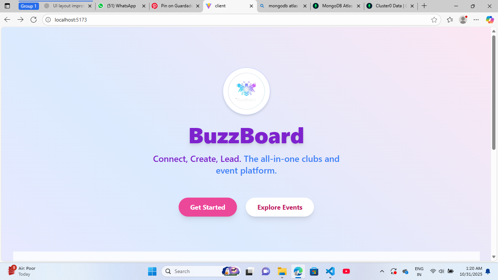
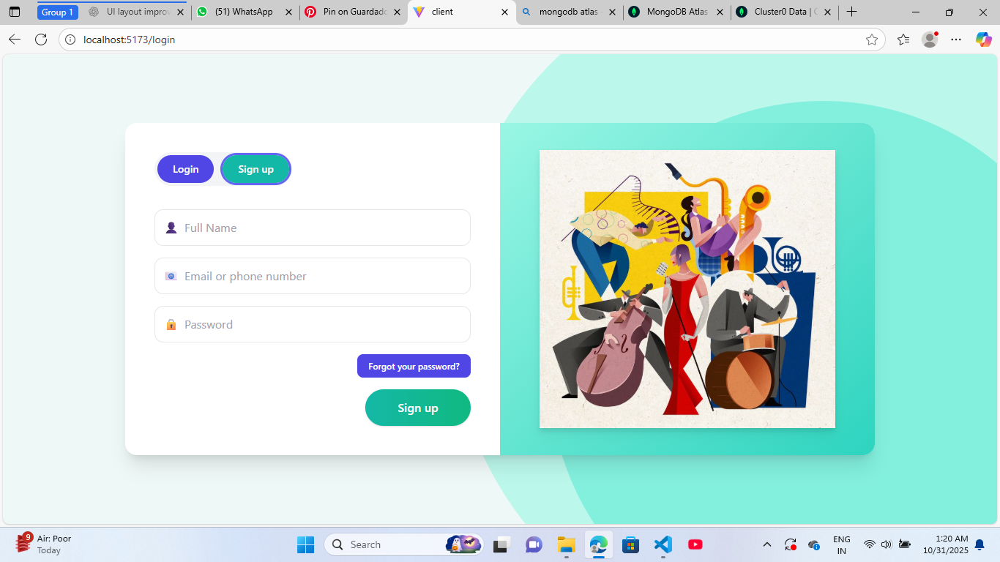
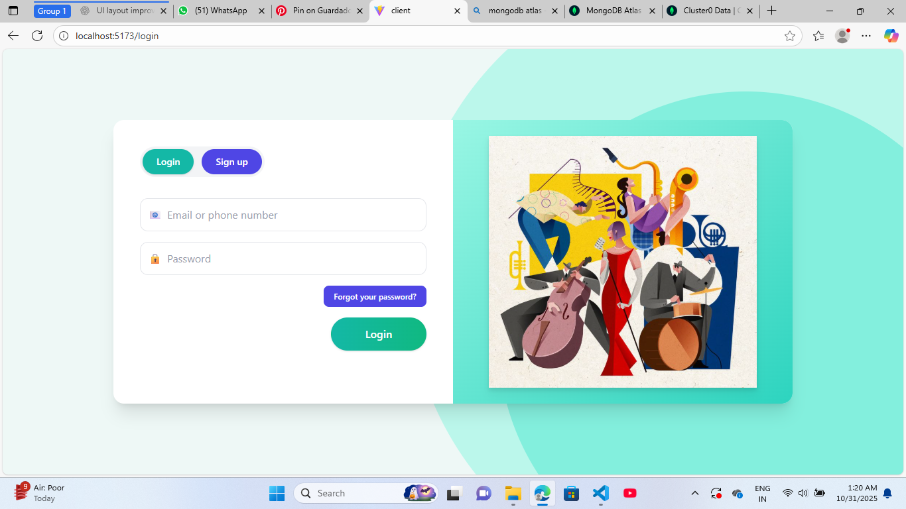
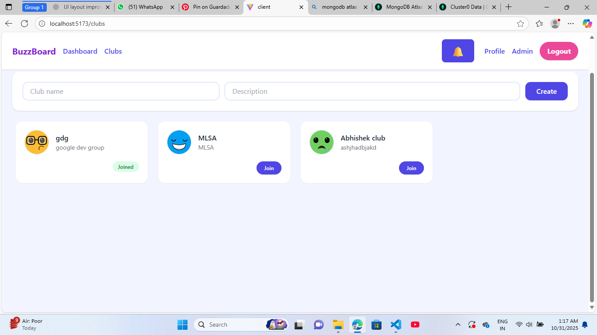
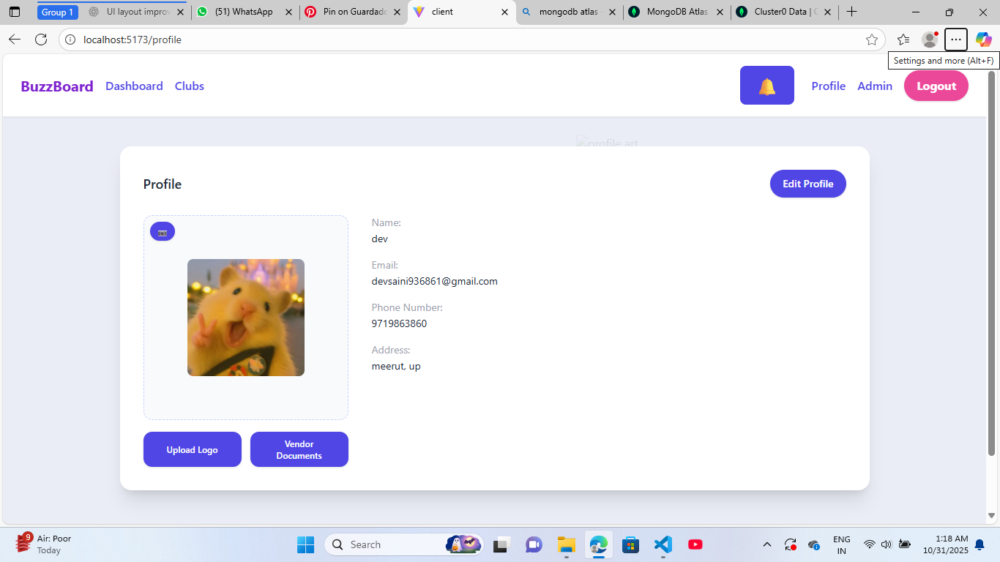
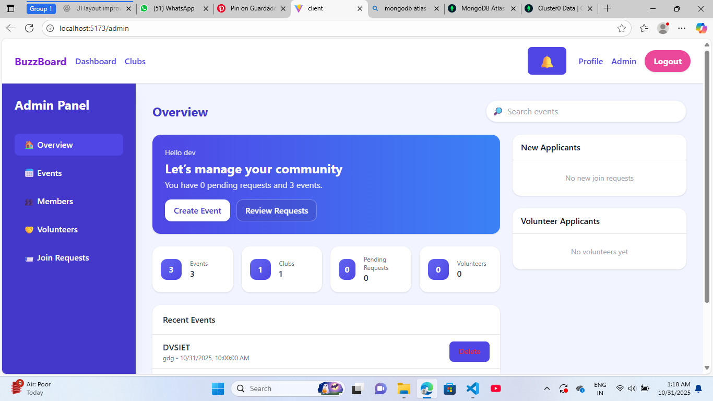
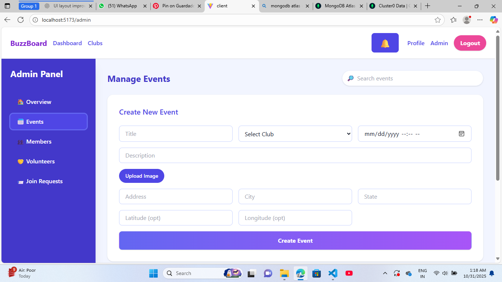
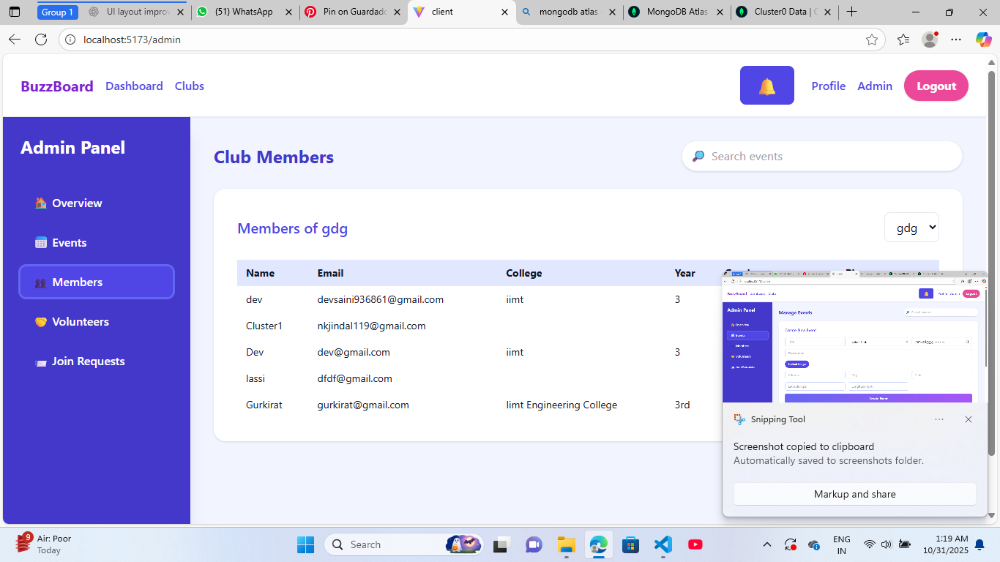
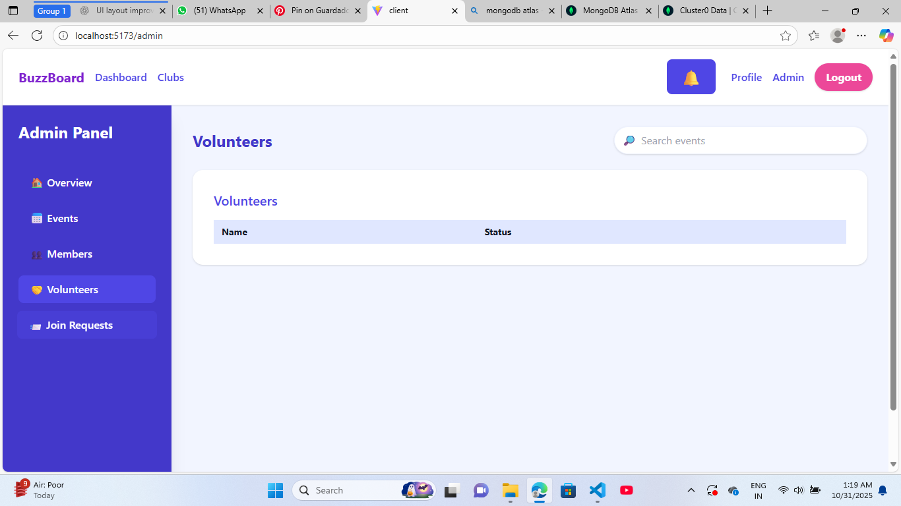
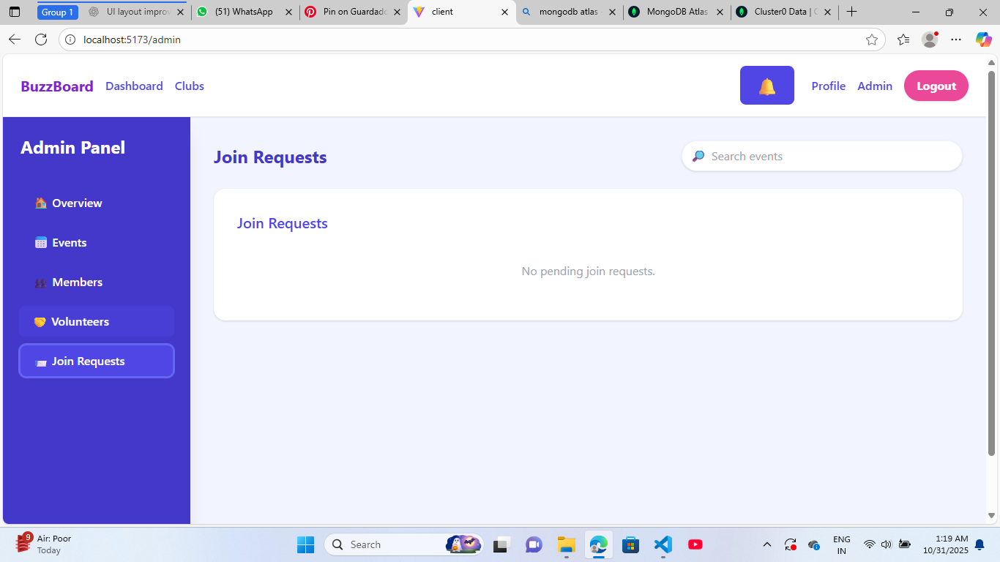

# BuzzBoard 🚀

> **Connect, Create, Lead. The all-in-one clubs and event platform.**

BuzzBoard is a comprehensive full-stack application built with the **MERN** (MongoDB, Express.js, React.js, Node.js) stack. It serves as a centralized hub for managing university or community clubs, organizing events, and coordinating members and volunteers.

## ✨ Key Features

* **User Authentication:** Secure sign-up and login functionality for users.
* **Club Management:** Users can discover, create, and join clubs.
* **Event Management:** Admins can create and manage events, including details like location, date, and description.
* **Admin Dashboard:** A powerful control panel for admins to get an overview of the community.
* **Member Management:** Admins can view and manage all members associated with specific clubs.
* **Request & Volunteer Management:** Systems for approving new member requests and managing event volunteers.
* **User Profiles:** Users can view and edit their personal information.

## 🛠️ Tech Stack

* **MongoDB:** NoSQL database to store all user, club, event, and volunteer data.
* **Express.js:** Back-end framework for building robust and scalable RESTful APIs.
* **React.js:** Front-end library for building a dynamic and responsive user interface.
* **Node.js:** JavaScript runtime environment for the server-side logic.

## 📸 Project Showcase

Here is a walkthrough of the BuzzBoard platform, from landing to the admin panel.

### 1. Landing Page
The first-look page for all visitors, introducing the platform's purpose.



---

### 2. Authentication
Secure sign-up and login for all users.

#### Sign Up Page
New users can create an account with their name, email, and password.



#### Log In Page
Registered users can access their accounts.



---

### 3. User Dashboard & Features
Once logged in, users can interact with the community.

#### Clubs Page
Users can see a list of available clubs, join them, or create their own.



#### User Profile Page
Users can view and manage their personal profile details.



---

### 4. Admin Panel
A dedicated dashboard for club organizers and administrators to manage the entire platform.

#### Admin Overview
The main dashboard displays key statistics like total events, clubs, pending requests, and volunteers. It also shows recent event activity and new applicants.



#### Manage Events
Admins can create new events using this detailed form.



#### Manage Members
Admins can filter by club to see a detailed list of all current members.



#### Manage Volunteers
This panel shows a list of all users who have signed up to volunteer for events.



#### Manage Join Requests
Admins can approve or deny pending requests from users wanting to join clubs.



## 🚀 Getting Started

To get a local copy up and running, follow these simple steps.

### Prerequisites

* Node.js (v18 or later)
* npm (or yarn)
* MongoDB (local installation or a MongoDB Atlas connection string)

### Installation

1.  **Clone the repo**
    ```sh
    git clone [https://github.com/Withdivyansh/buzzboard.git](https://github.com/Withdivyansh/buzzboard.git)
    cd buzzboard
    ```

2.  **Install Server Dependencies**
    ```sh
    cd server
    npm install
    ```
    *Create a `.env` file and add your `MONGO_URI` and `JWT_SECRET`.*

3.  **Install Client Dependencies**
    ```sh
    cd ../client
    npm install
    ```

4.  **Run the Application**
    * Run the server: `cd server && npm start`
    * Run the client: `cd client && npm start`